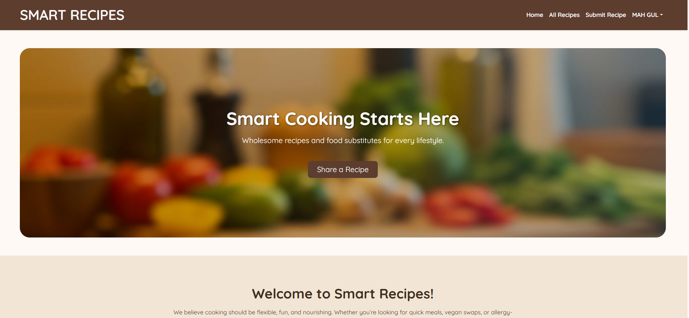
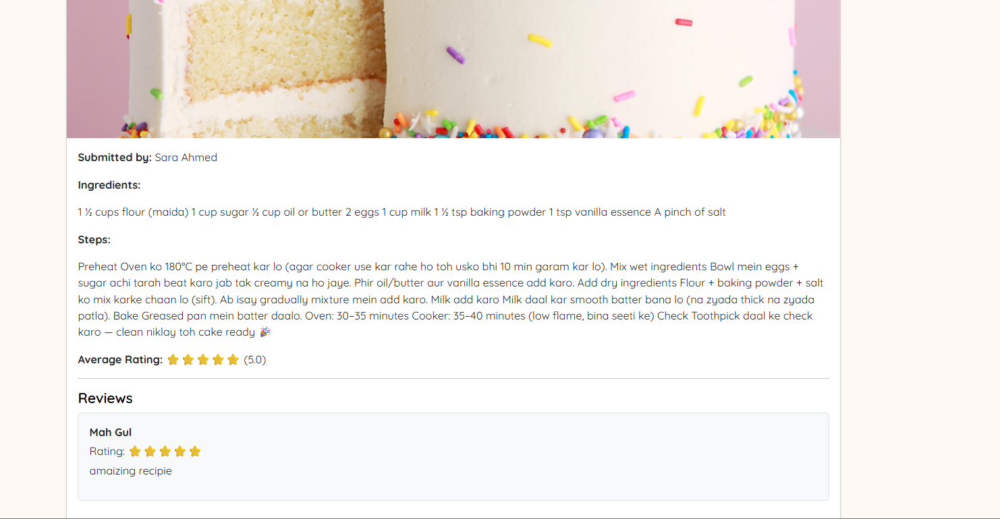
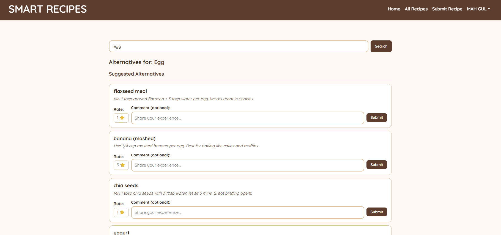
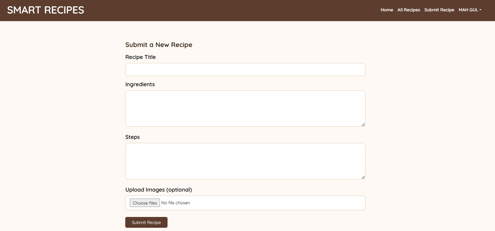

# Smart Recipes

A full-stack recipe sharing web application built as a Final Year Project using **Laravel** and **Bootstrap**. Smart Recipes allows users to discover, share, and review recipes, and find ingredient alternatives when a specific ingredient is unavailable.

> **Note:** My primary contribution on this project was as a **Frontend Developer** — responsible for designing and building all user-facing views, layouts, and interactive UI components to deliver a consistent and accessible user experience.

---

## Screenshots


```




```

---

## Features

- **Ingredient Alternatives Search** — Search any ingredient and find community-rated substitutes with usage tips and notes
- **Recipe Submission** — Authenticated users can submit recipes with step-by-step instructions and images
- **Recipe Reviews and Ratings** — Users can rate and review recipes; highest rated content appears first
- **Top Recipes on Homepage** — The three highest-rated recipes are featured on the landing page
- **User Authentication** — Register, login, and manage personal recipes and reviews
- **My Recipes / My Reviews** — Personal dashboard for managing submitted content
- **Admin Role** — Admin users have full control over recipes and site content

---

## Tech Stack

| Layer | Technology |
|-------|-----------|
| Backend | Laravel 11 (PHP) |
| Frontend | Blade Templates, Bootstrap 5, Custom CSS |
| Database | SQLite (development) / MySQL (production) |
| Authentication | Laravel Breeze |
| Image Handling | PHP GD (native) |
| Typography | Google Fonts — Quicksand |

---

## Getting Started

### Prerequisites

- PHP >= 8.2
- Composer

### Installation

**1. Clone the repository**
```bash
git clone https://github.com/your-username/smart-recipes.git
cd smart-recipes
```

**2. Install dependencies**
```bash
composer install
```

**3. Set up environment**
```bash
cp .env.example .env
php artisan key:generate
```

**4. Configure the database**

In your `.env` file, set:
```env
DB_CONNECTION=sqlite
```

Then create the SQLite database file:
```bash
# Windows (PowerShell)
New-Item -Path "database\database.sqlite" -ItemType File

# Mac / Linux
touch database/database.sqlite
```

**5. Run migrations and seed data**
```bash
php artisan migrate:fresh
php artisan db:seed
php artisan storage:link
```

**6. Start the development server**
```bash
php artisan serve
```

Open [http://127.0.0.1:8000](http://127.0.0.1:8000) in your browser.

---

## Demo Credentials

| Role  | Email                      | Password    |
|-------|----------------------------|-------------|
| Admin | admin@smartrecipes.com     | password123 |
| User  | sara@example.com           | password123 |
| User  | ali@example.com            | password123 |
| User  | hina@example.com           | password123 |

---

## Project Structure

```
smart-recipes/
├── app/
│   ├── Http/Controllers/
│   │   ├── RecipeController.php
│   │   ├── AlternativeController.php
│   │   ├── AlternativeReviewController.php
│   │   └── ReviewController.php
│   └── Models/
│       ├── Recipe.php
│       ├── RecipeImage.php
│       ├── Review.php
│       ├── IngredientAlternative.php
│       └── AlternativeReview.php
├── database/
│   ├── migrations/
│   └── seeders/
│       ├── RecipeSeeder.php
│       ├── IngredientAlternativesSeeder.php
│       └── AlternativeReviewSeeder.php
├── resources/
│   └── views/
│       ├── layouts/
│       ├── recipes/
│       ├── alternatives/
│       └── reviews/
└── routes/
    └── web.php
```

---

## Adding More Ingredient Alternatives

Open `database/seeders/IngredientAlternativesSeeder.php` and add entries to the `$alternatives` array:

```php
['ingredient' => 'maida', 'alternative' => 'wheat flour', 'notes' => 'Healthier substitute, use same amount.'],
```

Then run:
```bash
php artisan db:seed --class=IngredientAlternativesSeeder
```

---

## Frontend Contributions

As the frontend developer on this project, my responsibilities included:

- Designing the overall visual theme — a warm earthy colour palette (`#5c3d2e`, `#fef9f4`) inspired by a kitchen aesthetic
- Building all Blade view templates: homepage, recipe list, recipe detail, alternatives search, and dashboard pages
- Implementing fully responsive layouts using the Bootstrap 5 grid system
- Designing interactive star rating UI for both recipe and alternative reviews
- Building the recipe image carousel on the detail page
- Maintaining consistent navbar, footer, and typography (Quicksand font) across all views
- Styling all forms including recipe submission, review forms, and the ingredient search bar

---

## License

This project was developed for academic purposes as a Final Year Project.
